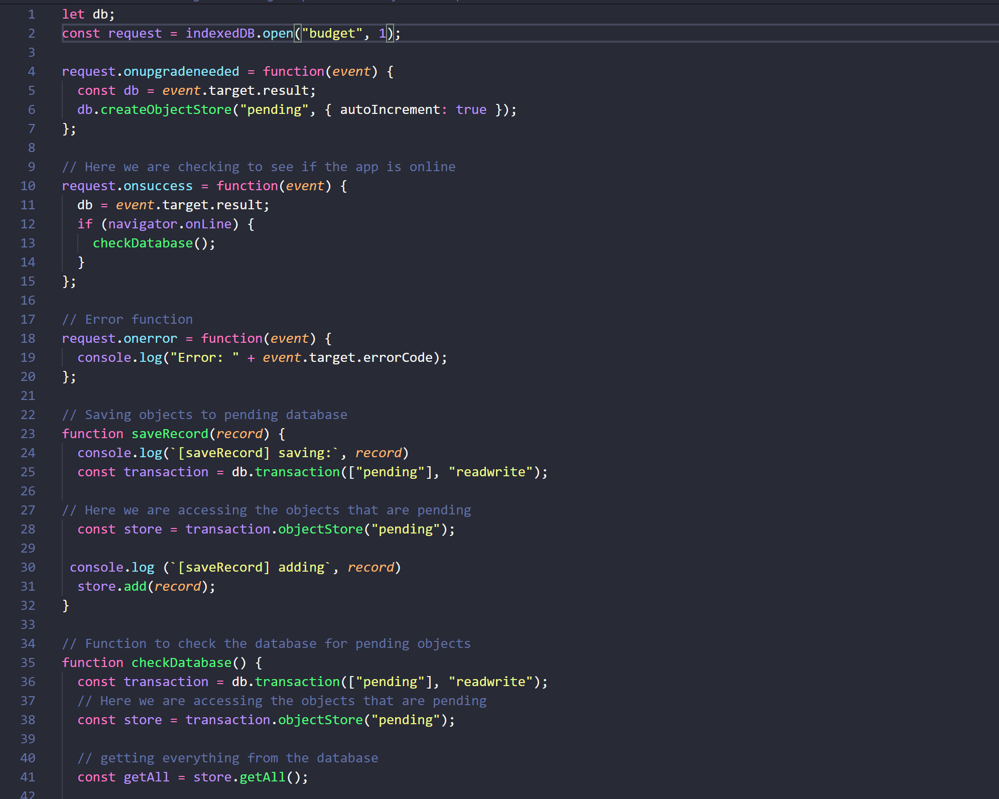
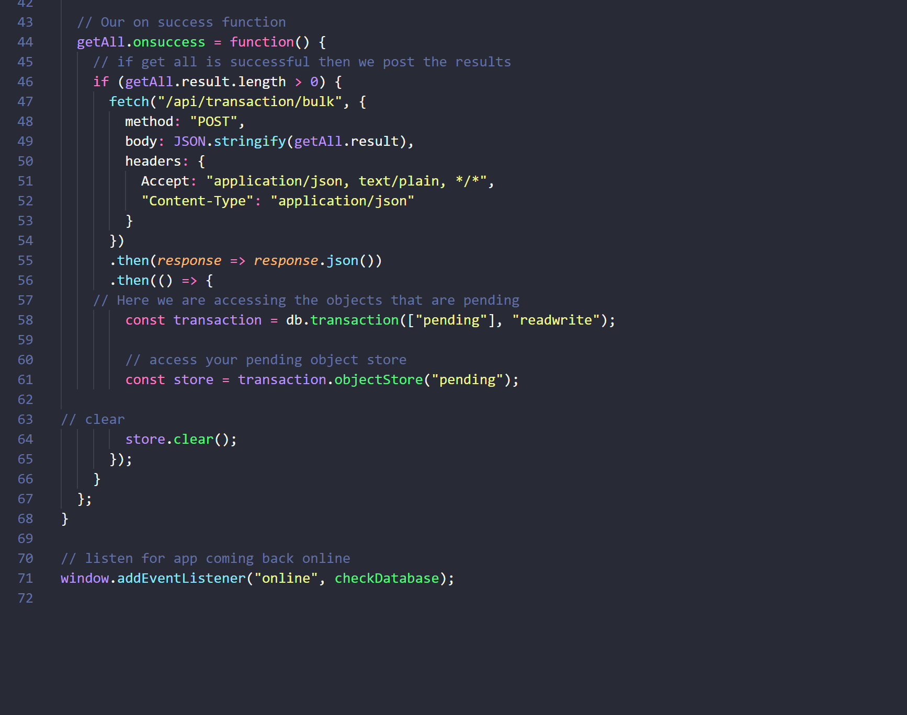
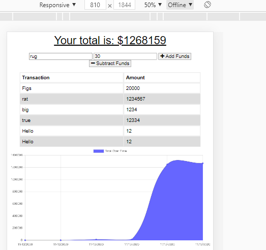
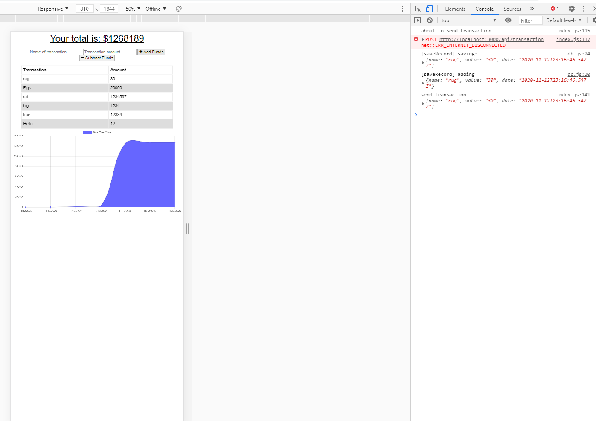
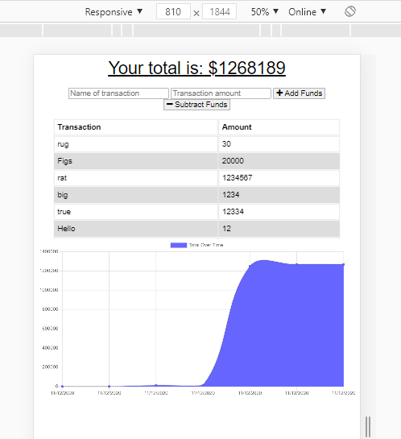

## **Table of Contents** 

  - [Description](#description)
  - [Elements](#elements)
  - [Installation Instructions](#installation)
  - [Usage](#usage)
  - [Contributors](#contributors)
  - [Aids](#aids)
  - [Links](#links)

## **Description**
For this project we had to create a budget app that would be accessible in both online and offline mode. Meaning the user had to be able to add inputs to the app even if it was in offline mode.

## **Elements**
In order to this we needed to add a database page to the public folder

In the database we needed to write a function that would check to see if we were in online of offline mode. 
If in offline mode it needed to save the records to an offline (pending) database.
Next it needed to be able to post things from that pending database even when offline and this all had to still be there when we reloaded in online mode.

## **Installation Instructions**
This project uses express, mongoose, morgan (middleware) and compression
  In terminal or gitbash npm install for these elements
  
## **Usage**

Here we see a user adding something to our budget app.

Here we see that according to our console log we managed to add the rug to our database.

Here we see that on reload and back in online mode the rug still appears. Showing we successfully added it to our budget app.

## **Contributors**
This project was done by:

Leah O'Gorman -- https://github.com/leahogorman

## **Aids**
This project was done with research on w3schools and stackoverflow

https://www.w3schools.com/

https://stackoverflow.com/

Additionally the project was done with aid from our instructors

Fil -- https://github.com/c0dehot

Daniel Ceballos -- https://github.com/shibeknight

## **Links**

Locally our project can run on: http://localhost:3000

The Heroku live link is: 

The Github link is: https://github.com/leahogorman/Progressive-Budget

